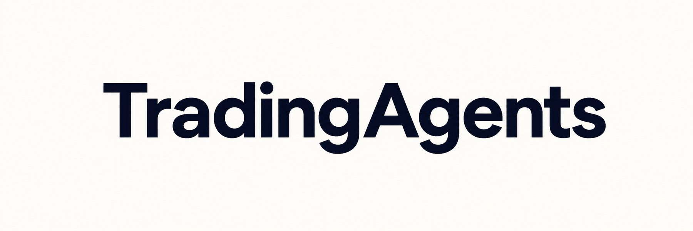

<h1 align="center">
  
</h1>

**Multi-agent market research with Alpaca paper trading and gated live execution.**

[![Python 3.10+][python-badge]][pyproject] [![Apache 2.0][license-badge]][license]

[Quick start](#quick-start) · [How it works](#how-it-works) · [Configuration](#configuration) · [Usage](#usage) · [Development](#development)

  

TradingAgents coordinates specialized LLM agents that analyze fundamentals, technical signals, news, and market sentiment. Bull and bear researchers debate the reports before a trader, risk team, and portfolio manager produce the final decision.

> [!CAUTION]
> TradingAgents is research software. It does not provide financial, investment, or trading advice. Model output, backtests, and paper results do not guarantee future performance.

## Features

- Fundamental, technical, news, and sentiment analysts
- Structured bull and bear research debate
- Trader, risk-management, and portfolio-management stages
- Cloud LLM providers and local Ollama models
- Persistent decision history and optional checkpoint recovery
- Alpaca account checks, order previews, paper workflows, and gated submission
- Stock and crypto analysis from the CLI or Python

## Quick start

TradingAgents requires Python 3.10 or newer. [uv](https://docs.astral.sh/uv/) is the recommended package manager.

~~~bash
git clone https://github.com/Nebulazer123/TradingAgentsAlpaca.git
cd TradingAgentsAlpaca
cp .env.example .env
# Add credentials for the LLM provider you plan to use.
uv sync
uv run tradingagents
~~~

The CLI prompts for the ticker, analysis date, provider, models, analyst roles, and research depth.

### Other installation options

With `pip`:

~~~bash
python3 -m venv .venv
source .venv/bin/activate
python -m pip install .
tradingagents
~~~

On Windows, activate the environment with `.venv\Scripts\activate`.

With Docker:

~~~bash
cp .env.example .env
docker compose run --rm tradingagents
~~~

The Compose file also includes an Ollama profile for local models:

~~~bash
docker compose --profile ollama run --rm tradingagents-ollama
~~~

## How it works

### Analysts

- **Fundamentals:** company financials, valuation, performance, and material risks
- **Sentiment:** supported social and market-attention sources
- **News:** company, sector, macroeconomic, and geopolitical events
- **Technical:** price, volume, momentum, and indicators

  

### Researchers

Bull and bear researchers test the analyst reports from opposing positions. Their debate becomes the trader's input.

  

### Trader

The trader combines the analyst reports and research debate into a proposed action.

  

### Risk team and portfolio manager

Aggressive, conservative, and neutral risk agents review the proposal. The portfolio manager returns the final decision.

  

## Configuration

Copy `.env.example` to `.env` and add the credentials for the provider you want to use. Do not commit `.env`.

~~~dotenv
OPENAI_API_KEY=
TRADINGAGENTS_LLM_PROVIDER=openai
TRADINGAGENTS_MAX_DEBATE_ROUNDS=2
TRADINGAGENTS_CHECKPOINT_ENABLED=true
~~~

The [environment template](.env.example) documents the other cloud providers, Ollama, optional market-data services, output settings, and Alpaca configuration. Provider and model selection are also available in the interactive CLI.

## Usage

Start an interactive analysis:

~~~bash
uv run tradingagents
~~~

Inspect the command groups:

~~~bash
uv run tradingagents --help
uv run tradingagents research --help
uv run tradingagents alpaca --help
~~~

  

Reports appear as each stage finishes.

  
  

## Python API

~~~python
from datetime import date

from tradingagents.default_config import DEFAULT_CONFIG
from tradingagents.graph.trading_graph import TradingAgentsGraph

config = DEFAULT_CONFIG.copy()
config["max_debate_rounds"] = 2

graph = TradingAgentsGraph(debug=True, config=config)
_, decision = graph.propagate("NVDA", date.today().isoformat())

print(decision)
~~~

`TradingAgentsGraph.propagate()` uses the stock pipeline by default. Pass `asset_type="crypto"` for the crypto pipeline. Configuration options live in [`tradingagents/default_config.py`](tradingagents/default_config.py).

## Alpaca

The Alpaca command group includes account checks, read-only reconciliation, order previews, paper workflows, portfolio supervision, and gated submission. The checked-in defaults disable paper submission and live mirroring.

~~~bash
uv run tradingagents alpaca --help
~~~

Credentials and feature flags are documented in [`.env.example`](.env.example).

## Persistence and recovery

| State | Default location | Control |
| --- | --- | --- |
| Decision history | `~/.tradingagents/memory/trading_memory.md` | `TRADINGAGENTS_MEMORY_LOG_PATH` |
| Checkpoints | `~/.tradingagents/cache/checkpoints/` | `--checkpoint` and `TRADINGAGENTS_CACHE_DIR` |

~~~bash
uv run tradingagents analyze --checkpoint
uv run tradingagents analyze --clear-checkpoints
~~~

## Project layout

| Path | Purpose |
| --- | --- |
| `cli/main.py` | Typer command surface |
| `tradingagents/agents/` | Analyst, researcher, trader, and risk agents |
| `tradingagents/graph/` | LangGraph workflow |
| `tradingagents/research/`, `tradingagents/dataflows/` | Research and market-data routes |
| `tradingagents/brokers/` | Alpaca integration and portfolio supervision |
| `tradingagents/policy/`, `tradingagents/execution/` | Policy checks, locks, and execution coordination |
| `tradingagents/evals/` | Evaluation and calibration |
| `tests/` | Test suite |

## Development

~~~bash
uv sync --group static-analysis
uv run pytest -q
uv run --group static-analysis ruff check cli tradingagents scripts tests
~~~

Include tests with behavior changes. Pull requests should explain what changed and call out any effect on broker or policy behavior. Release notes and contributor credits live in the [changelog](CHANGELOG.md).

## Citation

This repository builds on the multi-agent framework described in [*TradingAgents: Multi-Agents LLM Financial Trading Framework*](https://arxiv.org/abs/2412.20138).

~~~bibtex
@misc{xiao2025tradingagentsmultiagentsllmfinancial,
  title         = {TradingAgents: Multi-Agents LLM Financial Trading Framework},
  author        = {Yijia Xiao and Edward Sun and Di Luo and Wei Wang},
  year          = {2025},
  eprint        = {2412.20138},
  archivePrefix = {arXiv},
  primaryClass  = {q-fin.TR},
  url           = {https://arxiv.org/abs/2412.20138}
}
~~~

## License

Licensed under the [Apache License 2.0](LICENSE).

[python-badge]: https://img.shields.io/badge/Python-3.10%2B-3776AB?logo=python&logoColor=white
[license-badge]: https://img.shields.io/badge/license-Apache--2.0-0F766E
[pyproject]: pyproject.toml
[license]: LICENSE
